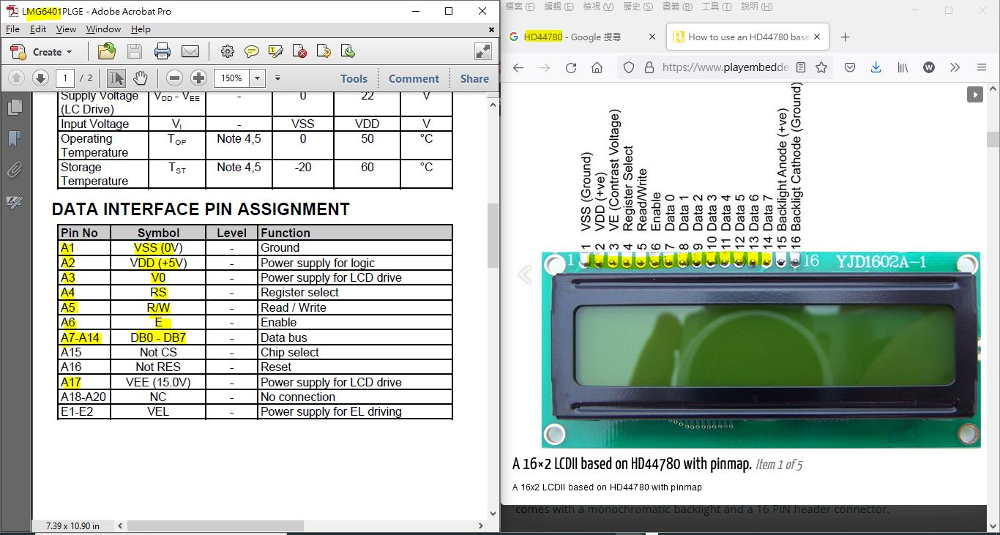
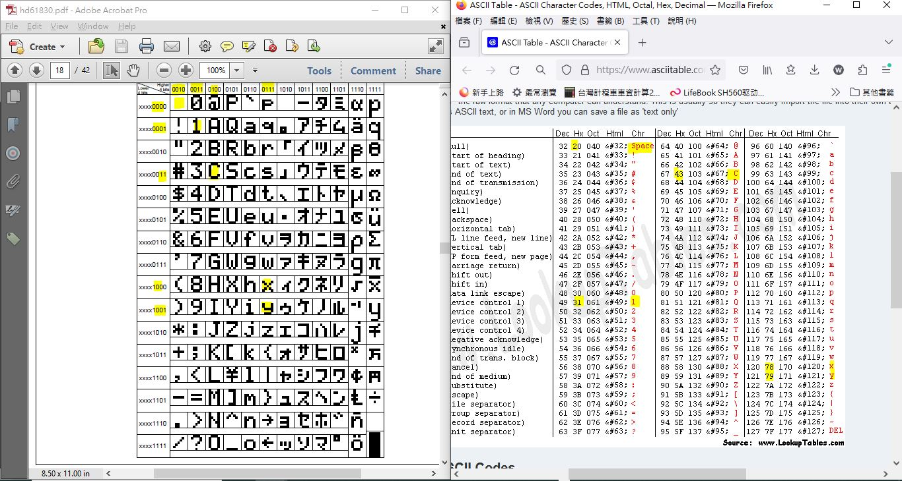
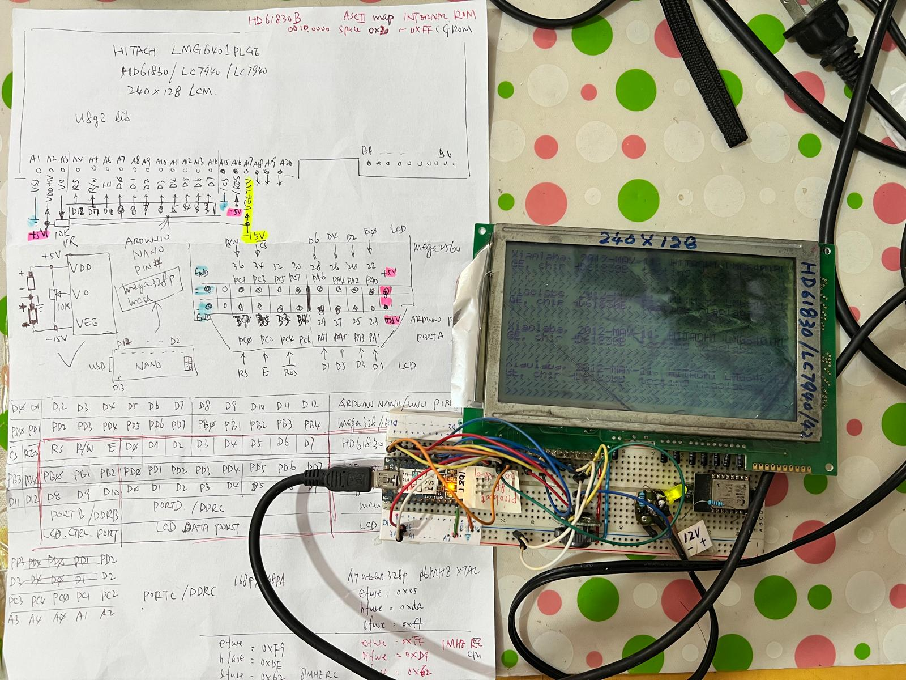
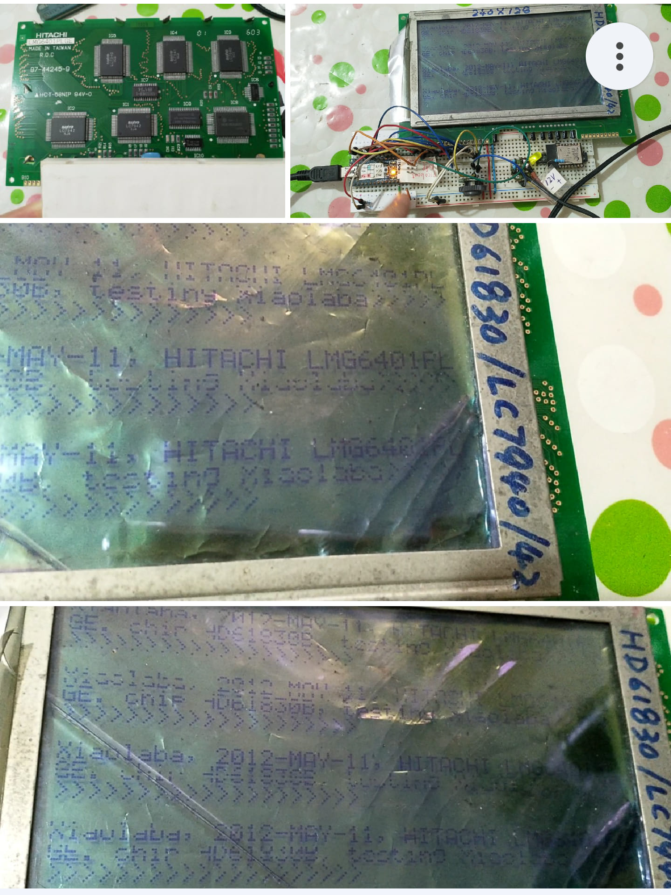
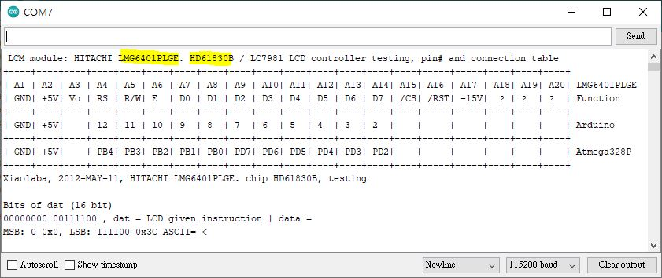

LMG6401PLGE_HD68130B_TEST_OK  
no lib is used, recovered from old archive   
by xiaoalab   
...   
almost_44780_compatible.JPG  
  
...  
github_build_README.md.bat  
  
...  
HD61830_CGROM_ASCII_MAP_xiao.JPG  
  
...  
HD61830_datasheet.pdf  
  
...  
LM6401PLGE_testing_done_xiao.jpg  
  
...  
LM6401PLGE_testing_result_xiao.jpg  
  
...  
LMG6401PLGE_HD61830B_TEST_OK.ino  
  
...  
LMG6401PLGE_HD61830B_TEST_OK.m168.hex  
  
...  
LMG6401PLGE_HD61830B_TEST_OK.m168.pwith.bootloader.hex  
  
...  
LMG6401PLGE_HD61830B_xiao_schematic.pdf  
  
...  
LMG6401PLGE_HD61830B_xiao_schematic_VEE_corrected_symbol.pdf  
  
...  
LMG6401PLGE_Hitachi_datasheet_wrong VEE_bat_symbol.pdf  
  
...  
README.md  
  
...  
UART_screen_xiao.JPG  
  
...  
