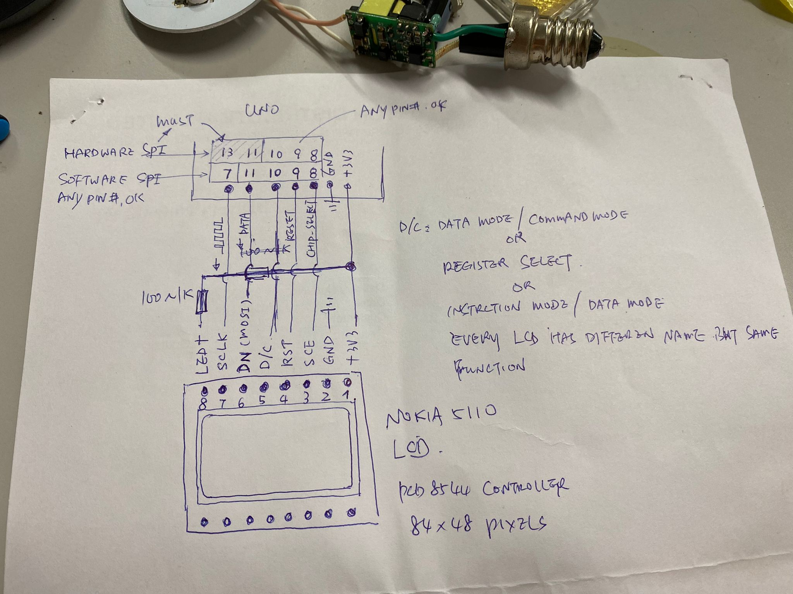
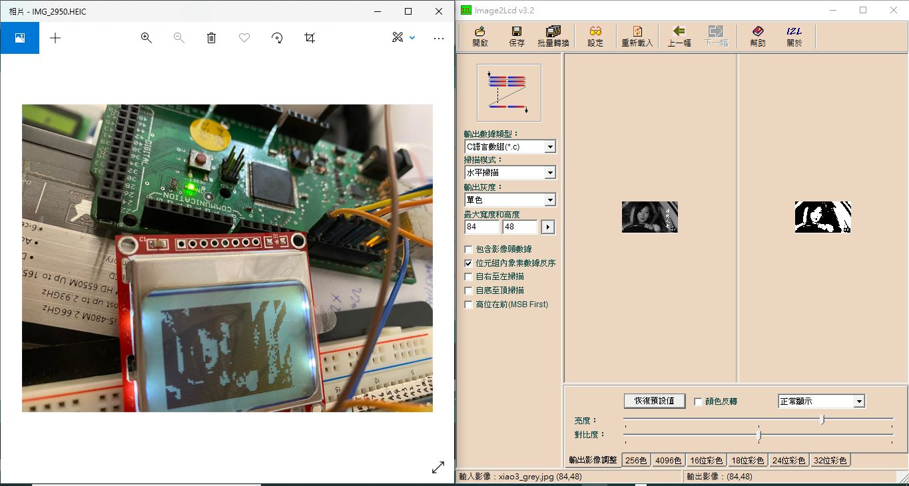
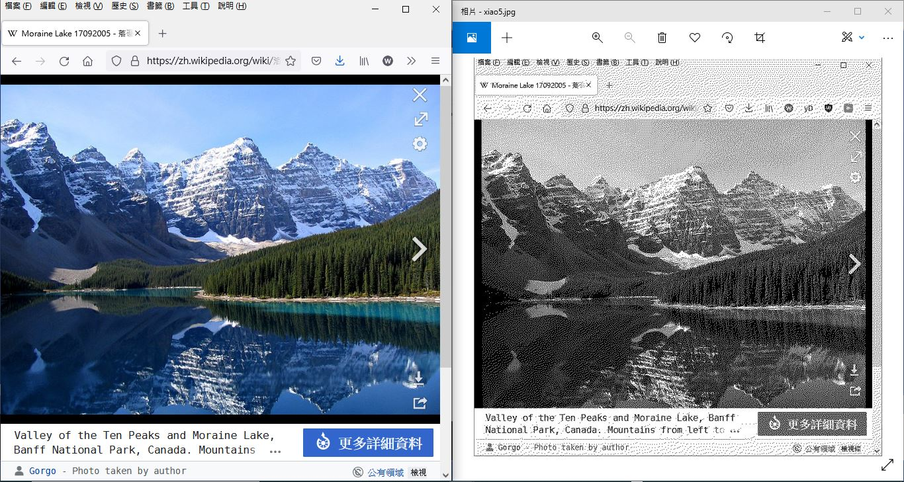
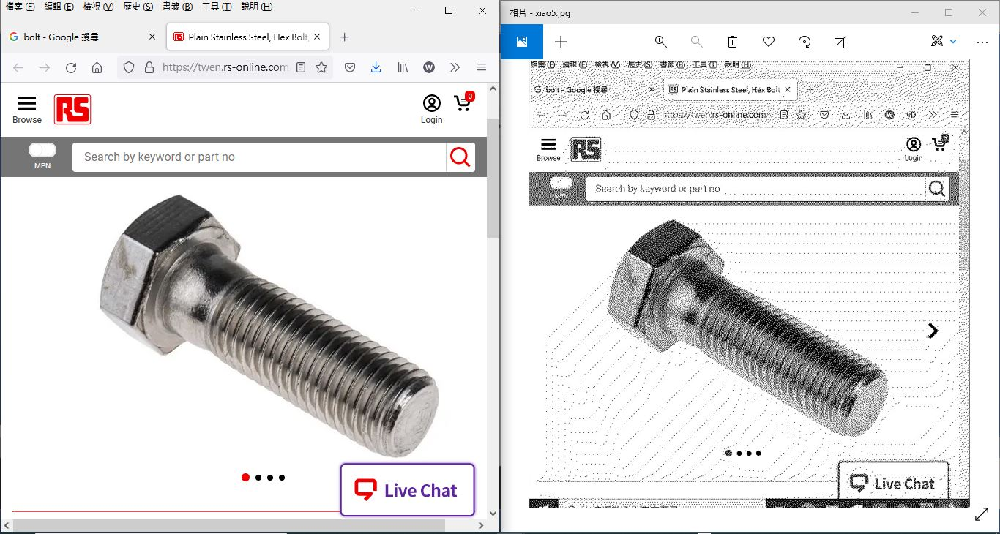

# u8g2-Nokia_LCD_5110-LMG6401PLGE-testing
try to uses u8g2 LCD library, some good some odd

### [LMG6401PLGE](LMG6401PLGE), HD61830, controller, testing NG, did not know why
all files/modified and build.bat available

HITACHI LCD LMG6401PLGE, 240x128  
chips:  
HD61830, controller  
LC7940, x-driver x3, 80 col x3 = 240 pixel of width  
LC7942, y-driver x2, 64 row x2 = 128 pixel of height  

```
copy from,
https://www.youtube.com/watch?v=WmnEPF2JpjA
https://sergeev.io/projects/lc7981_driver/

https://github.com/LongHairedHacker/avr-lc7981

http://www.skippari.net/lcd/sekalaista/lcd_hd61830_lib.zip
http://forum.lcdinfo.com/viewtopic.php?t=451 HD61830 programing (VB); graphic LCD
https://juvar.fi/?p=34, Controlling graphic dot matrix LCD display

http://www.skippari.net/lcd/sekalaista/lcd_hd61830_lib.zip
http://forum.lcdinfo.com/viewtopic.php?t=451 HD61830 programing (VB); graphic LCD
https://juvar.fi/?p=34, Controlling graphic dot matrix LCD display


modified Makefile and codes
setup build.bat for win10 and Microchio AVR8 toolchain

build is ok
testing, NG
LCD failure ? or library is not supporting HD61830/LC7940/LC7942 ? did not know

HITACHI LCD LMG6401PLGE, 240x128
chips:
HD61830, controller
LC7940, x-driver x3, 80 col x3 = 240 pixel of width
LC7942, y-driver x2, 64 row x2 = 128 pixel of height

2021-AUG-10 by xiaolaba

```


### Nokia 5110 LCD, controller PCD8544  

old project, no library used, [LCD5110_test](LCD5110_test), [readme](https://xiaolaba.wordpress.com/2019/02/07/arduino-lcd-5110-pcd-8544-test-ok/)    

circuit diagram,  
  

pixel 84 x 48 ??  
testing ok, notes,  

wire connections  
NOKIA 5110 LCD pin | Arduino pin
```
LED+, 1k resistor, connect to +3V3, or just no connectio then no backlight   
CLK = 7; // Must connect to Arduino NANO D13 (SPI SCLK) when using SPI library  
DN = 11; // Must connect to Arduino NANO D11 (SPI MOSI) when using SPI library  
DC = 10; // RS (register select)  
RST = 9;  // reset  
SCE = 8;  // cs of u8g2, chip select    
GND = GND;  // Ground
VCC = +3V3; // power supply
```

setup in software,  
```
//// xiaolaba, testing, 2021-AUG-10
//// software SPI mode, any port pin is ok
//// dc : Data/Command pin, or RS (Register Select) pin
//// U8G2_Rx, LCD image orientations
//U8G2_PCD8544_84X48_F_4W_SW_SPI u8g2(U8G2_R0, /* clock=*/ 13, /* data=*/ 11, /* cs=*/ 8, /* dc=*/ 10, /* reset=*/ 9);  // Nokia 5110 DisplayU8G2_PCD8544_84X48_F_4W_SW_SPI //u8g2(U8G2_R0, /* clock=*/ 7, /* data=*/ 11, /* cs=*/ 8, /* dc=*/ 10, /* reset=*/ 9);  // Nokia 5110 Display
//U8G2_PCD8544_84X48_F_4W_SW_SPI u8g2(U8G2_R1, /* clock=*/ 13, /* data=*/ 11, /* cs=*/ 8, /* dc=*/ 10, /* reset=*/ 9);  // Nokia 5110 Display
U8G2_PCD8544_84X48_F_4W_SW_SPI u8g2(U8G2_R2, /* clock=*/ 7, /* data=*/ 11, /* cs=*/ 8, /* dc=*/ 10, /* reset=*/ 9);  // Nokia 5110 Display
//U8G2_PCD8544_84X48_F_4W_SW_SPI u8g2(U8G2_R3, /* clock=*/ 13, /* data=*/ 11, /* cs=*/ 8, /* dc=*/ 10, /* reset=*/ 9);  // Nokia 5110 Display

//// hardware SPI mode, CLK / DATA pin is specific for every MCU
//U8G2_PCD8544_84X48_F_4W_HW_SPI u8g2(U8G2_R0,                                  /* cs=*/ 8, /* dc=*/ 10, /* reset=*/ 9);   // Nokia 5110 Display
//U8G2_PCD8544_84X48_F_4W_HW_SPI u8g2(U8G2_R1,                                  /* cs=*/ 8, /* dc=*/ 10, /* reset=*/ 9);   // Nokia 5110 Display
//U8G2_PCD8544_84X48_F_4W_HW_SPI u8g2(U8G2_R2,                                  /* cs=*/ 8, /* dc=*/ 10, /* reset=*/ 9);   // Nokia 5110 Display
//U8G2_PCD8544_84X48_F_4W_HW_SPI u8g2(U8G2_R3,                                  /* cs=*/ 8, /* dc=*/ 10, /* reset=*/ 9);   // Nokia 5110 Display

// lcd2image produced image array
// change 1st line to uses flash memory for ROM stroage, save RAM used
// const unsigned char gImage_xiao3[528] = { /* 0X20,0X01,0X54,0X00,0X30,0X00, */
// const unsigned char gImage_xiao3[528] PROGMEM = { /* 0X20,0X01,0X54,0X00,0X30,0X00, */
#include "img\xiao1.h"
#include "img\xiao2.h"
#include "img\xiao3.h"
#include "img\xiao4.h"
```

  

complete project files,
[Mega2560_u8g2_LCD5110_HelloWorld](Mega2560_u8g2_LCD5110_HelloWorld)

demo video,
[https://www.youtube.com/watch?v=h8Ii3jQoLog](https://www.youtube.com/watch?v=h8Ii3jQoLog)


### what is the next ??
dithering and the mono image display with mono LCD  
why and how  

[https://www.youtube.com/watch?v=0L2n8Tg2FwI](https://www.youtube.com/watch?v=0L2n8Tg2FwI) my replication of the code used, see [processing_source_code](processing_source_code)     
[https://forum.arduino.cc/t/grey-scale-images-on-monochrome-displays/517591](https://forum.arduino.cc/t/grey-scale-images-on-monochrome-displays/517591)  
[https://github.com/bitbank2/image_to_c](https://github.com/bitbank2/image_to_c)  
[https://zhuanlan.zhihu.com/p/33637225](https://zhuanlan.zhihu.com/p/33637225) [什么是抖色Dithering?——节选自《高兴说显示进阶篇之三》](什么是抖色Dithering——节选自《高兴说显示进阶篇之三》.pdf)  Spatial Dithering, Temporal Dithering 也叫Frame Rate Control（FRC）
https://en.wikipedia.org/wiki/Floyd%E2%80%93Steinberg_dithering  


### here is the next, Floyd–Steinberg dithering, demo video, workdone  
抖音, 抖色, Floyd–Steinberg dithering, learning how to code, work done  
https://youtu.be/NrdAuk-bxzk 


### processing and bug
smaller images are not so easy to see the bug, RGB images are also, these is example to find the bug as blanking area is big enoguh, some dotted lines are coming up, but why and how to improve those? no idea.
  
  
